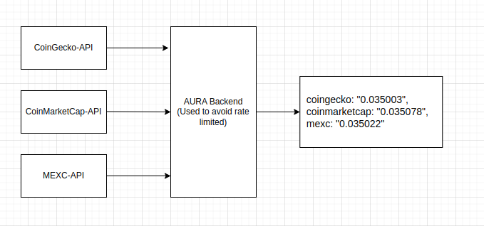

# Aura Network Price Fetcher

This Python script is designed to fetch the current USD price of the Aura Network cryptocurrency using the CoinGecko API.

## Requirements

- Python 3
- `requests` library

## Installation

Before running the script, ensure you have Python 3 installed on your system. You can then install the required `requests` library using pip:

```bash
pip install requests
```

## Usage

To use the script, run it from the command line with Python:

```bash
python aura_price-coingecko.py
```

## Integration with AURA Backend to avoid Rate Limiting issue


AURA Backend should return an API to help aura_price-coingecko.py, aura_price-coinmarketcap.py and aura_price-mexc.py to fetch the price with USD of AURA from CoinGecko, CoinMarketCap and MEXC. The API response should be in the following format:

```
{
  coingecko: "0.035003",
  coinmarketcap: "0.03500302",
  mexc: "0.03500302"
}
```