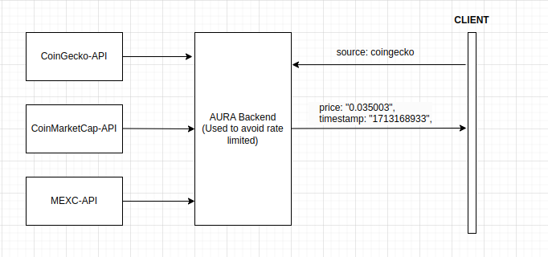

# Aura Network Price Fetcher

This Python script is designed to fetch the current USD price of the Aura Network cryptocurrency using the CoinGecko API.

## Requirements

- Python 3
- `requests` library

## Installation

Before running the script, ensure you have Python 3 installed on your system. You can then install the required `requests` library using pip:

```bash
pip install requests
```

## Usage

To use the script, run it from the command line with Python:

```bash
python coingecko-aura-price.py
```

## Integration with AURA Backend to avoid Rate Limiting issue


AURA Backend should return an API to help coingecko-aura-price.py, aura_price-coinmarketcap.py and aura_price-mexc.py to fetch the price with USD of AURA from CoinGecko, CoinMarketCap and MEXC.
The input of the API should be the name of the exchange, and the output should be the corresponding price and timestamp.

The input param of API should be in the following format:

```
{
  source: "coingecko"
}
```

The API response should be in the following format:

```
{
  price: "0.035003",
  timestamp: "1713168933",
}
```

Note: Backend should handle the rate limiting issue of CoinGecko, CoinMarketCap and MEXC. Each source should be limited to 1 request per 30 second. If the rate limit is reached, the API should return the latest price and timestamp.